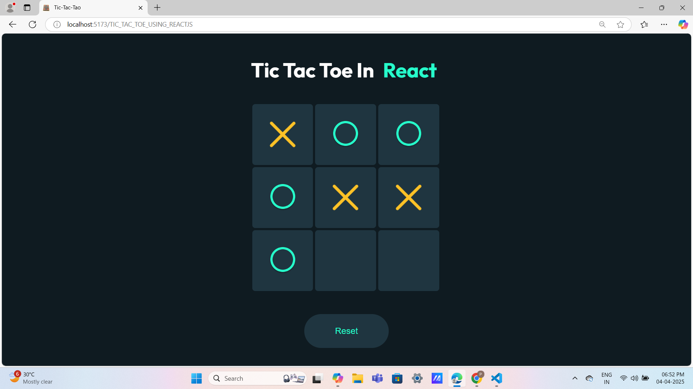
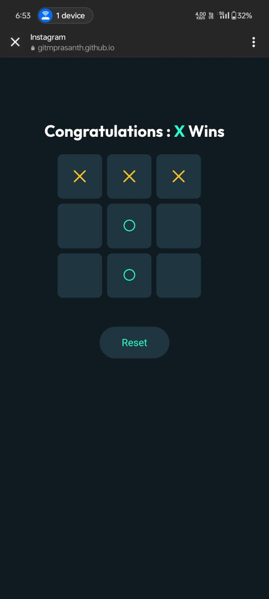

# Tic-Tac-Toe Game 🎲

A simple Tic-Tac-Toe game built with React.js, utilizing `useState` for managing the game state and `useRef` for direct DOM manipulation.

## Features ✨
- Interactive 3x3 grid for gameplay.
- Displays winner or draw status dynamically.
- Reset button to restart the game.
- Uses React Hooks (`useState` & `useRef`) for state management and DOM handling.
- Fully responsive UI with a modern design.

## Technologies Used 🛠️
- React.js (Functional Components)
- JavaScript (ES6)
- HTML5 & CSS3
- State management using `useState`
- DOM access using `useRef`

### Screenshots 

#### Responsive for both Desktop and Mobile view

